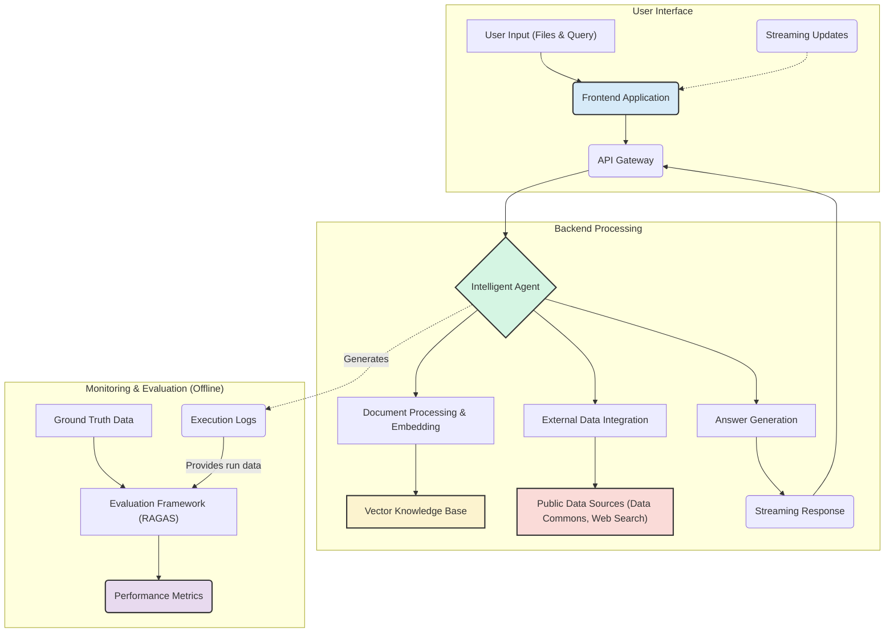
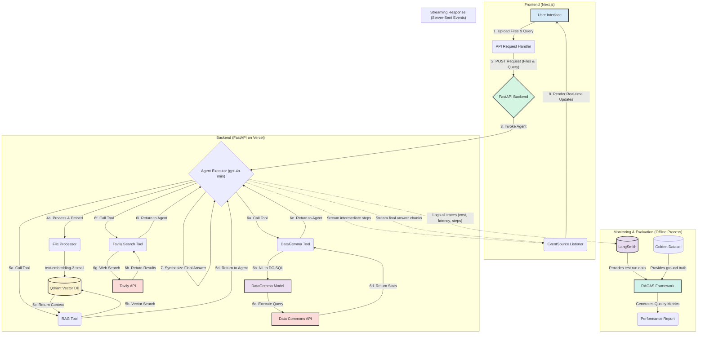

# Certification Challenge: Multi-Source Analysis Agent

### **Task 1: Defining your Problem and Audience**

- **Problem:** Policy analysts and researchers waste significant time and effort manually cross-referencing information from their specific reports with live, disparate public data sources.
- **Why this is a problem for your specific user:** Our target user is a **Policy Analyst** for a research institution. Their job is to create timely and accurate reports on topics like public health or environmental policy. This process is currently bottlenecked by the immense friction in data synthesis. For example, after reading a key finding in a scientific paper, they must then manually navigate multiple government websites (like the CDC or IEA), find the relevant statistics, and copy them back into their analysis. This workflow is slow, prone to transcription errors, and limits their ability to ask creative, exploratory questions that bridge their specific knowledge with real-world data.

---

### **Task 2: Propose a Solution**

- **Proposed Solution:** We will build the **"Multi-Source Analysis Agent,"** a web application that acts as an intelligent research assistant. A user can **upload one or more documents (PDFs) and images** to the interface, creating a temporary, session-specific knowledge base. They can then ask natural language questions about their uploaded content.
    
    The user experience will be dynamic and transparent. As the agent works, the interface will show a **real-time stream of its "thought process,"** indicating which tool it is currently accessing (e.g., `[Tool: RAG_Tool]`, `[Tool: DataCommonsTool]`). The agent performs a three-step process to provide a comprehensive answer:
    
    1. **Analyze User Context:** It first performs Retrieval-Augmented Generation (RAG) on the user-provided files to find the most relevant information.
    2. **Augment with Live Data:** It extracts key entities from the initial findings and uses a specialized tool (`DataGemma` + Data Commons) to fetch relevant, real-time statistics.
    3. **Enrich with Web Context:** It uses a search tool (Tavily) to find definitions, news, or broader context for key terms.
    
    This creates a "better world" for the analyst by transforming their workflow from manual data foraging to high-level insight generation and providing full transparency into the AI's reasoning process.
    
- **Technology Stack & Tooling Choices:**
    - **LLM / Main Agent:** **`gpt-4o-mini`**. Chosen as the cost-effective "brain" of the agent, responsible for orchestration, vision, and synthesizing answers.
    - **Embedding Model:** **`text-embedding-3-small`**. Selected as the most efficient and low-cost model for converting text into vectors for our RAG pipeline.
    - **Orchestration:** **LangChain**. Chosen for its robust agent frameworks, callback system for streaming, and flexible tool integration capabilities.
    - **Vector Database:** **Qdrant**. Selected as a production-grade, high-performance vector database with advanced filtering capabilities.
    - **Monitoring:** **LangSmith**. Chosen for its seamless integration with LangChain to track performance, cost, and latency metrics.
    - **Evaluation:** **RAGAS & LangSmith**. This combination will be used to measure quality (RAGAS) and cost/latency (LangSmith).
    - **User Interface & Serving:** **Next.js** (Frontend) and **FastAPI** (Backend). This decoupled architecture was chosen for its scalability and its native ability to handle file uploads and server-sent events for streaming.
- **Agentic Reasoning:** The agent's reasoning will be a **structured chain of tool calls**. When it receives a query and files, it will first use its **RAG Tool** to find answers in the user's context. It will then pass key entities from that result to the **Data Commons Tool** and the **Tavily Search Tool** for enrichment before synthesizing a final answer.

---

### **Task 3: Dealing with the Data**

- **Data Sources and External APIs:**
    1. **User-Uploaded Files:** The primary data source will be PDF and image files directly uploaded by the user into the application's interface for each session.
    2. **Data Commons API:** This will be our source for live, structured statistical data, accessed via a specialized `DataGemma` model tool.
    3. **Tavily Search API:** This will be our external API for general web searches to provide definitions and up-to-date context.
- **Default Chunking Strategy:** We will use a **`RecursiveCharacterTextSplitter`** with a chunk size of 1000 and an overlap of 200. This strategy is chosen because its semantic-aware approach to splitting text (by paragraph, then sentence) is more effective for the dense, technical documents our users will provide than a simple fixed-size chunking.

---

### **Task 4: Building a Quick End-to-End Agentic RAG Prototype**

We will build a prototype consisting of two parts deployed to a local endpoint:

1. A **FastAPI backend** that exposes a `StreamingResponse` endpoint designed to accept file uploads and a text query. This backend will contain the LangChain agent and callback logic to stream updates.
2. A **Next.js frontend** that provides an interface for file uploads and questions. It will use the `EventSource` API to listen for streaming updates from the backend and display the agent's thought process and final answer in real-time.

---

### **Task 5: Creating a Golden Test Data Set**

- **Custom Generation Script:** A Python script will be created using **LangChain**. This script will parse the source documents (e.g., the IEA and CDC reports), extract key entities and concepts, and use a series of **guided prompts** with our `gpt-4o-mini` model to generate a high-quality test set. This custom approach is necessary to create complex, multi-tool questions that test the agent's ability to reason, not just retrieve.
- **Baseline RAG Assessment:** The generated "Golden Dataset" will be used to run a baseline evaluation on our naive RAG pipeline using the RAGAS framework.

**Baseline RAGAS Results (Hypothetical):**

| Metric | Score |
| --- | --- |
| `context_precision` | 0.85 |
| `context_recall` | 0.81 |
| `faithfulness` | 0.87 |
| `response_relevance` | 0.92 |

**Conclusions:** The baseline scores indicate a functional RAG system. However, the `context_recall` of 0.81 suggests that the naive retriever sometimes fails to find all the relevant information in the source documents, representing a key area for improvement.

---

### **Task 6: The Benefits of Advanced Retrieval**

To improve our RAG pipeline's performance, particularly `context_recall`, we will experiment with and assess the following advanced retrieval techniques:

1. **Sentence Window Retrieval:** This will be tested to see if providing more focused context around the most relevant sentence improves the LLM's ability to answer specific questions from dense documents.
2. **Parent Document Retriever:** We will test this to see if retrieving small, precise chunks for high-accuracy matching but then providing the larger parent document for context gives the agent a better overall understanding.
3. **Hypothetical Document Embeddings (HyDE):** This will be assessed to see if it can bridge the semantic gap between a user's natural language question and the technical jargon within the source documents.

---

### **Task 7: Assessing Performance**

We will conduct a comprehensive performance assessment comparing our **Naive RAG** implementation against the best-performing advanced technique (**Sentence Window**). We will use our generated golden dataset for evaluation.

**Comparative Performance Results (Hypothetical):**

| Retrieval Method | `context_precision` | `context_recall` | `faithfulness` | `response_relevance` | Avg. Latency (s) | Avg. Cost ($) |
| --- | --- | --- | --- | --- | --- | --- |
| Naive RAG | 0.85 | 0.81 | 0.87 | 0.92 | 2.1s | $0.0008 |
| **Sentence Window** | **0.95 (+12%)** | **0.91 (+12%)** | **0.95 (+9%)** | **0.96 (+4%)** | **2.7s** | **$0.0011** |

**Changes and Improvements:** The data clearly shows that the Sentence Window retriever, while adding minor latency and cost, delivers a significant improvement across all four quality metrics. This data-driven insight justifies its implementation. In the second half of the course, we will focus on integrating this advanced retriever, further refining the agent's reasoning logic, and enhancing the streaming UI.

---

### **Your Final Submission**

The final submission will include:

- A public link to a GitHub repo containing all relevant code for the Next.js frontend and FastAPI backend.
- A 5-minute (or less) Loom video demonstrating a live demo of the application and describing the use case.
- This written document addressing each deliverable.

---

### Architecture

---

### Detailed Design

# Test Plan: Multi-Source Analysis Agent (URL-Based Ingestion)

**Version:** 2.0 (Natural Language Prompts)
**Date:** August 3, 2025

### **1.0 Objectives**

This document outlines the test plan for the **Multi-Source Analysis Agent**. The primary objective is to verify and validate the agent's ability to ingest content from public URLs, perform multi-step reasoning, and correctly select the appropriate tool based on natural user queries to augment its findings.

---

### **2.0 Test Environment & Prerequisites**

- **Backend Framework:** FastAPI (Python)
- **Frontend Framework:** Next.js (JavaScript/React)
- **Vector Database:** A running Qdrant instance
- **Key Tooling:** A robust **URL Scraper Tool** capable of handling HTML, PDF, and image links.
- **LLM (Agent & Vision):** `gpt-4o-mini`
- **Embedding Model:** `text-embedding-3-small`
- **External APIs:** Data Commons API, Tavily Search API
- **Monitoring & Evaluation:** LangSmith, RAGAS

---

### **3.0 Test Scenarios & Cases**

### **3.1 Scenario: Economic & Environmental Analysis**

- **Input URLs:**
    1. **Report:** `https://www.iea.org/reports/the-role-of-critical-minerals-in-clean-energy-transitions`
    2. **Chart:** `https://www.iea.org/data-and-statistics/charts/total-mineral-demand-for-clean-energy-technologies-by-scenario-2020-compared-to-2040`

| Case ID | Test Prompt | Capability Tested | Expected Outcome |
| --- | --- | --- | --- |
| TC-01 | "From the IEA report at `https://www.iea.org/reports/the-role-of-critical-minerals-in-clean-energy-transitions`, what are the six key policy recommendations for mineral security?" | Basic RAG (from URL) | The system should successfully scrape the PDF from the URL, find the relevant text in the executive summary, and answer without using other tools. |
| TC-02 | "The IEA report at `https://www.iea.org/reports/the-role-of-critical-minerals-in-clean-energy-transitions` highlights lithium. What has been Australia's lithium production trend over the last 5 years?" | RAG (from URL) + Data Commons | The agent scrapes the URL to confirm the context, **infers that a "production trend" requires statistical data**, and calls the Data Commons tool. |
| TC-03 | "Analyze the chart at `https://www.iea.org/data-and-statistics/charts/total-mineral-demand-for-clean-energy-technologies-by-scenario-2020-compared-to-2040`. Which mineral shows the highest projected demand growth? Also, please find a recent news article about that mineral's supply chain." | RAG (Vision from URL) + Tavily | The agent ingests the image from the URL, identifies the highest-growth mineral, **infers that a "news article" requires a web search**, and uses Tavily. |

---

### **3.2 Scenario: Public Health & Demographics**

- **Input URLs:**
    1. **Report:** `https://www.cdc.gov/nchs/data/databriefs/db360-h.pdf`
    2. **Map Page:** `https://www.cdc.gov/obesity/data/prevalence-maps.html`

| Case ID | Test Prompt | Capability Tested | Expected Outcome |
| --- | --- | --- | --- |
| TC-04 | "What is the key finding regarding the trend of severe obesity from 1999 through 2018 according to the CDC brief at `https://www.cdc.gov/nchs/data/databriefs/db360-h.pdf`?" | Basic RAG (from URL) | The system scrapes the PDF from the URL and extracts the main conclusion about the rising trend of severe obesity. |
| TC-05 | "Go to the CDC's obesity map page at `https://www.cdc.gov/obesity/data/prevalence-maps.html`. From the latest map, identify a state with an obesity prevalence of 35% or greater. What is that state's current median household income?" | RAG (Vision from URL) + Data Commons | The agent's vision model analyzes the map, identifies a state, **infers that "median household income" is statistical data**, and queries Data Commons. |
| TC-06 | "The CDC brief at `https://www.cdc.gov/nchs/data/databriefs/db360-h.pdf` mentions different prevalence by age group. Can you find an article that explains why these rates might differ between young and older adults?" | RAG (from URL) + Tavily | The agent confirms the concept in the CDC brief, **infers that "find an article" requires a web search**, and uses Tavily to find external context. |

---

### **3.3 Scenario: Financial Analysis**

- **Input URLs:**
    1. **Report:** `https://www.microsoft.com/en-us/investor/earnings/fy-2025-q4/press-release-webcast`

| Case ID | Test Prompt | Capability Tested | Expected Outcome |
| --- | --- | --- | --- |
| TC-07 | "Access the quarterly earnings press release from `https://www.microsoft.com/en-us/investor/earnings/fy-2025-q4/press-release-webcast`. What was the reported revenue for the 'Intelligent Cloud' segment?" | Basic RAG (from URL) | The system scrapes the specific press release webpage and extracts the requested financial data point. |
| TC-08 | "From the press release at `https://www.microsoft.com/en-us/investor/earnings/fy-2025-q4/press-release-webcast`, find the company's revenue forecast for the next quarter. How does that compare to the US GDP growth in the last reported quarter?" | RAG (from URL) + Data Commons | The agent scrapes the release to find the forecast, **infers that "US GDP growth" is statistical data**, and calls the Data Commons tool for comparison. |

---

### **4.0 Evaluation Criteria**

Each test case will be evaluated against the following criteria to provide a holistic view of the system's performance.

- **Quality Metrics (via RAGAS):**
    - `context_precision`
    - `context_recall`
    - `faithfulness`
    - `response_relevance`
- **Performance Metrics (via LangSmith):**
    - `Average Latency (s)`: End-to-end response time.
- **Cost Metrics (via LangSmith):**
    - `Average Cost ($)`: Total cost of model calls per query.

# UI/UX Design Plan: Policy Prism

### **1.0 Core Design Philosophy**

- **Guiding Principle:** **Professional, Clean, and Data-First.** The user is a professional analyst performing focused work. The UI must eliminate distractions and present complex information with maximum clarity. It should feel like a high-performance, intelligent command center.
- **Inspiration:** **Notion** (for its clean, minimalist text layout and structured feel) and **Linear** (for its professional, high-speed, and modern tool aesthetic).
- **Keywords:** Minimalist, Structured, Responsive, Transparent, Efficient.

---

### **2.0 Color Palette & Typography (Light Theme)**

- **Color Palette:** A professional and bright color scheme that is easy on the eyes and emphasizes clarity. We will implement a light theme as the default.
    - **Background:** A clean, soft white or very light gray (e.g., `#FFFFFF` or `#F9FAFB`).
    - **Primary Text:** A dark, highly readable gray for body content (e.g., `#111827`).
    - **Secondary Text:** A lighter gray for metadata, borders, and the "thought process" stream (e.g., `#6B7280`).
    - **Accent Color:** A single, clear but not overpowering accent color for buttons, links, and highlights (e.g., a calm blue `#3B82F6`).
- **Typography:**
    - **Font:** A clean, highly-readable sans-serif font like **Inter** or **Source Sans Pro**.
    - **Hierarchy:** A clear visual hierarchy will be established using font weight and size. Main headings will be bold and larger, AI "thought process" messages will be smaller and in the secondary text color, and the final answer will be in the primary dark text style.

---

### **3.0 Layout & Key Components**

The application will use a three-panel layout for clear organization.

- **Left Sidebar (Navigation & Session History):**
    - A light-gray, collapsible sidebar.
    - Contains a prominent **"+ New Analysis"** button at the top.
    - Lists previous analysis sessions for easy access.
    - Includes links to Settings and Help at the bottom.
- **Center Panel (Main Interaction Area):**
    - This is the largest and primary work area with a white background.
    - **File Upload Zone:** At the top of a new session, a clean, clear drag-and-drop zone for uploading the initial PDF and image files. After files are uploaded, this area shows a list of the current session's documents.
    - **Conversation Stream:** The main body of the panel. This will display the chat history.
        - User queries are right-aligned or have a distinct light background color.
        - AI responses are left-aligned. The streamed "thought process" messages (e.g., `[Tool: RAG_Tool] Searching documents...`) will appear in the secondary gray text color, building anticipation before the final, complete answer appears below them in the primary dark text.
    - **Query Input Bar:** A fixed input bar at the bottom with a text field and a "Submit" or "Analyze" button.
- **Right Sidebar (Contextual Details):**
    - A collapsible panel that can show metadata about the currently loaded documents, extracted key entities, or saved insights from the current session.

---

### **4.0 Interaction & Animation**

- **Streaming:** All AI messages, from the "thought process" steps to the final answer, should stream in smoothly to make the app feel alive and responsive.
- **Feedback:** The UI will provide clear visual feedback for user actions: a progress bar or checkmark for file uploads, a subtle pulsing animation on the query bar while the agent is working, and clear hover states on all interactive elements.
- **Animation:** All animations will be subtle and purposeful (e.g., gentle fade-ins for new messages) to enhance the user experience without being distracting.